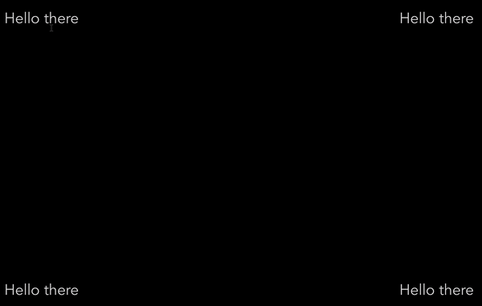

## Getting started
This is a tooltip component for VueJS 2.x

**Note:** The tooltip will automatically position itself based on the position of the hovered element in the page, as shown on the gif below:



1. Install the Component:
```
npm install --save v-poptool
```

2. Register the Component to your app:
```javascript
import Vue from 'vue'
import Vtooltip from 'v-poptool'

components: {
    Vtooltip
}
```

## Usage
1. Add the component wherever you need it.
```html
<vtooltip>
    <div slot="content">This is what goes inside the tooltip</div>
    <div slot="tooltip-text">Hover over me</div>
</vtooltip>
```

## Options
| Option             | Description                                                      | Value                  | Default  |
|--------------------|------------------------------------------------------------------|------------------------|----------|
| color            | text color of the tooltip                                  | String                | #FFF  |
| backgroundColor          | background color of the tooltip                              | String | #000         |
| fontSize         | font size of the tooltip                             | Number | 10          |
| textAlign             | text alignment within the tooltip                                     | String                 | left         |
| arrowPlacement              | position of the tooltip's arrow                | String                | left  |
| hOffset         | horizontal offset of the tooltip                                          | Number                 |  0        |
| vOffset         | vertical offset of the tooltip                                          | Number                 |  0        |
| arrowOffset  | horizontal offset of the arrow | Number                | 0  |

#### Options Example:
```html
<vtooltip :options="{
	color: 'red',
    backgroundColor: '#DDD',
    fontSize: 16,
    textAlign: 'center',
    arrowPlacement: 'right',
    hOffset: 10,
    Voffset: 2,
    arrowOffset: 15
}">
    <div slot="content">This is a tooltip with custom options</div>
    <div slot="tooltip-text">Hover over me</div>
</vtooltip>

```
## Build the example
Go to the `examples` folder and run `npm run dev`
